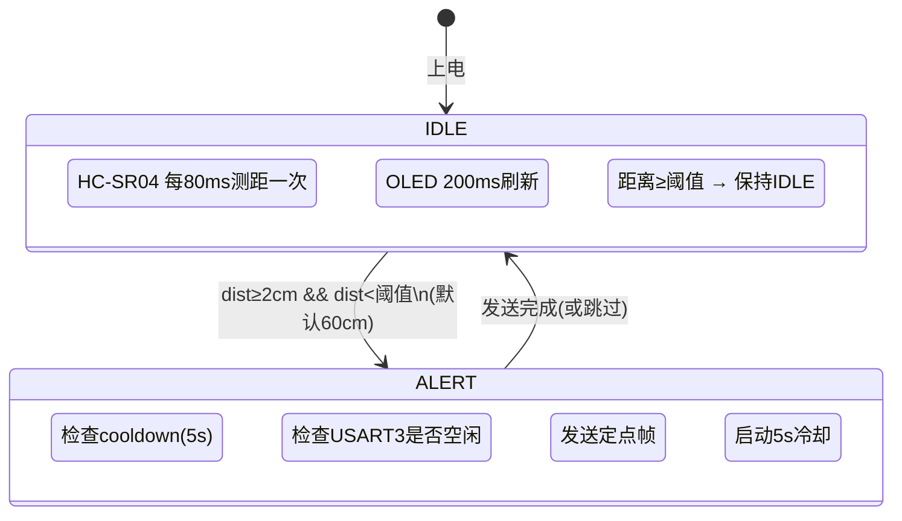
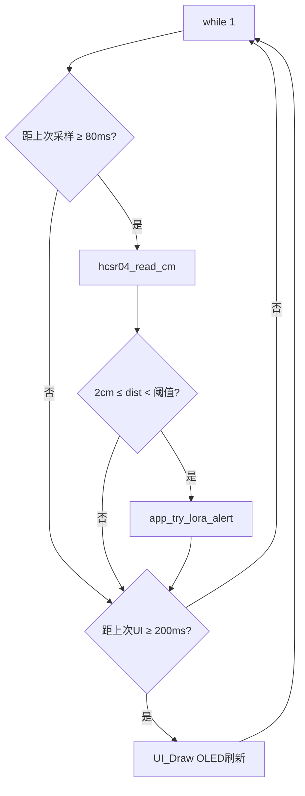
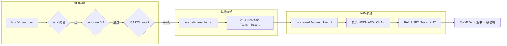

# Lora — HC-SR04 超声波触发 + EWM22A LoRa 定点遥测

STM32F103C8T6 + EWM22A LoRa 模组 + HC-SR04 超声波 + OLED 128×64

## 功能

HC-SR04 每 80ms 测距一次，当距离低于阈值时，通过 EWM22A LoRa 模组向指定地址定点发送遥测数据帧。OLED 实时显示距离、倒计时、发送状态和遥测正文。

## 硬件连接

| 外设 | 接口 | 引脚 | 说明 |
|------|------|------|------|
| EWM22A LoRa | USART3 | PB10 TX, PB11 RX | 115200 8N1, 3.3V 供电 |
| HC-SR04 | GPIO | PA0 Trig, PA1 Echo | Echo 5V→3.3V 须分压 |
| OLED | I2C1 | PB6 SCL, PB7 SDA | 128×64 SSD1306 |
| M0/M1 (遗留) | GPIO | PB3, PB4 | 输出低 (A39 遗留，已不使用) |

## 状态机



## 主循环流程



## LoRa 发送链路



## 核心常量 (app_config.h)

| 常量 | 值 | 说明 |
|------|----|------|
| `DIST_THRESHOLD_CM` | 60 | 触发距离阈值 (cm) |
| `HCSR04_SAMPLE_PERIOD_MS` | 80 | 超声波采样周期 |
| `LORA_ALERT_COOLDOWN_MS` | 5000 | 两次发送最小间隔 |
| `LORA_EWM22A_BAUD` | 115200 | USART3 波特率 |
| `LORA_DST_ADDR` | 0x0003 | 目标模组 16 位地址 |
| `LORA_DST_CHAN` | 30 | LoRa 信道号 (十进制) |
| `LORA_EWM22A_PAYLOAD_MAX` | 237 | 载荷最大字节数 |
| `LORA_TEAM_NUMBER` | 63 | 队伍编号 |

## 定点帧格式

STM32 通过 USART3 发送给 EWM22A 的每帧数据：

```
┌────────┬────────┬────────┬──────────────────────┐
│ ADDH   │ ADDL   │ CHAN   │ 遥测正文              │
│ 1 byte │ 1 byte │ 1 byte │ N bytes               │
└────────┴────────┴────────┴──────────────────────┘
  MSB      LSB      十进制    例: Current time 12:00:05,
           0x0003 = 目标地址   Team number 63, Name Baba booey,
                              Race duration 0:05\r\n
```

模组须预先配置为定点传输模式 (`AT+TRANS=1`, `AT+HMODE=1`)。

## OLED 显示布局

```
┌──────────────────────────────┐
│ LORA TX  12:00:05            │  Row 1: 标题 + 时钟
│──────────────────────────────│
│ Team:63 Name:Baba booey      │  Row 2: 队伍信息
│ Race: 00:05                  │  Row 3: 比赛计时
│──────────────────────────────│
│ Dist: 45cm  [████████░░] <60 │  Row 4: 距离 + 阈值进度条
│──────────────────────────────│
│ TX 12:00:00 (next 3s)        │  Row 5: 上次发送时间 + cooldown
│ >...booey, Race duration...  │  Row 6: 遥测正文滚动预览
└──────────────────────────────┘
```

## 文件结构

```
Lora/
├── Core/
│   ├── Inc/
│   │   ├── main.h              ← M0_Pin / M1_Pin 定义
│   │   └── stm32f1xx_it.h
│   └── Src/
│       ├── main.c              ← 主循环 + OLED UI + 触发逻辑
│       └── stm32f1xx_it.c
├── Lib/
│   ├── Inc/
│   │   ├── app_config.h        ← 全部可调参数
│   │   ├── lora_ewm22a.h       ← EWM22A 驱动接口
│   │   ├── lora_telemetry.h    ← 遥测格式化
│   │   └── hcsr04.h            ← 超声波驱动接口
│   └── Src/
│       ├── lora_ewm22a.c       ← 定点帧组帧 + IT 发送
│       ├── lora_telemetry.c    ← 遥测正文生成
│       └── hcsr04.c            ← TIM2 微秒级测距
├── Lora.ioc                    ← CubeMX 工程
├── CMakeLists.txt
└── README.md                   ← 本文件
```

## A39 → EWM22A 迁移记录

| 项目 | 旧 (A39-T900) | 新 (EWM22A) |
|------|-------------|------------|
| 波特率 | 9600 | 115200 |
| 模式引脚 | M0/M1 (PB4/PB3) | 无 |
| 组帧方式 | MCU 组 3 字节头 | 相同 |
| 触发逻辑 | 距离 < 阈值 | 相同 |
| cooldown | 5s | 5s |

旧驱动 `lora_a39.c/h` 已删除，`M0_Pin/M1_Pin` 定义保留在 main.h 中但仅输出低电平。

## 编译

```bash
cmake --preset Debug -S .
cmake --build build/Debug
```

## 接收端配对要求

- 模组本机地址 = `LORA_DST_ADDR` (0x0003)
- 信道 = `LORA_DST_CHAN` (30)
- 空中速率、带宽、扩频因子等与发送端一致
- `AT+TRANS=1` (定点传输)
- `AT+HMODE=1` (非配置模式)
